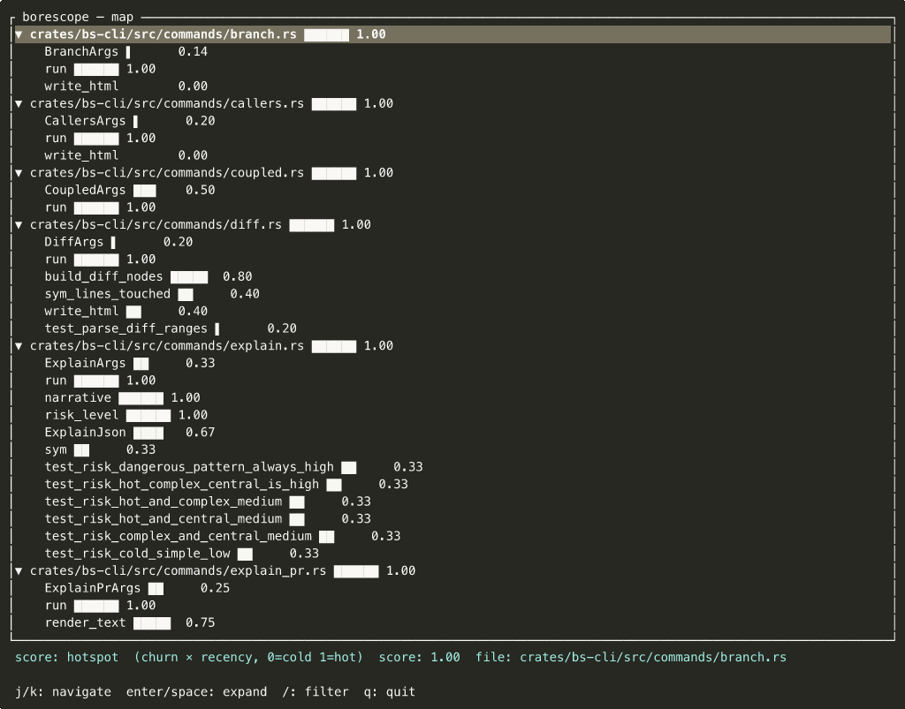

# Borescope

**Call graphs from structure, not execution. In every language, without running the code.**

```
borescope paths api/checkout.go:HandleCheckout --depth 4 --weight hotspot
```
```
HandleCheckout                           ██████ 0.82
├─ validateCart()                        ████   0.61
│  ├─ PriceService.quote()               ▌      0.07
│  └─ Inventory.check()                  █      0.12
├─ services.boot()                       ▌      0.05
└─ SessionManager.open()   ┄┄ 0.5        █      0.15
```

Index any repo in seconds. Ask "what calls this?", "what does this reach?", "what changed?", "what's risky?" — and get answers you can act on, not just grep output.



---

## Install

```bash
cargo install --path crates/bs-cli   # from source, requires Rust 1.70+
# or: download a release binary from GitHub Releases
```

### Use with Claude Code

**Step 1 — install the skill** (one time, globally):

```bash
borescope skill > ~/.claude/skills/borescope.md
```

This embeds borescope into Claude Code's context. From now on, Claude Code knows to run
`borescope` instead of reading files when navigating or editing code in any repo.

**Step 2 — index your repo** (once per repo, re-run after large merges):

```bash
cd your-repo
borescope index --no-git    # fast — structural queries ready immediately
borescope index --git &     # background — adds hotspot/churn/co-change signals
```

**Step 3 — open Claude Code and start working.**

Claude Code will automatically:
- Run `borescope callers <file>:<symbol>` before modifying a function to find all callers
- Run `borescope paths <symbol> --analyze` to understand what a symbol reaches before touching it
- Use `borescope diff` after edits to check blast radius
- Prefer `borescope explain <symbol>` over reading the source file for context

You can also ask explicitly:
```
"what calls db.go:InsertOrder?"
"trace the path from handler to db and show load signals"
"what changed in the call tree compared to main?"
"show the antipattern report"
```

Claude Code will translate these into the right `borescope` commands using the skill instructions.

### Use with Cursor

```bash
mkdir -p .cursor/rules
borescope skill > .cursor/rules/borescope.md
```

### Use with OpenHands or other agents

```bash
borescope skill > /tmp/borescope-skill.md
# pass to your agent's --system-prompt-file flag or equivalent
```

### All-in-one installer

```bash
./skill/ensure-borescope.sh --skill    # installs binary + Claude Code skill
./skill/ensure-borescope.sh --cursor   # installs binary + Cursor rule
```

## 30-second start

```bash
cd your-repo

# Two-phase index: structural queries work immediately; git signals load in background
borescope index --no-git            # fast — paths/callers/map/explain ready now
borescope index --git &             # background — hotspots/smells/age ready when done

borescope hotspots                  # what's hot and complex?
borescope map --weight hotspot -o tui   # navigate the whole repo interactively
borescope smells                    # antipattern + semantic risk report
borescope explain src/auth.rs:verify    # plain-English symbol profile
```

---

## Why borescope

### You're about to edit a function you didn't write
```bash
borescope callers src/auth/token.go:Verify --depth 4 -o tui
```
See everything that depends on it before you touch a line. The bar chart is churn × recency — read it as blast radius × fire risk.

### You're reviewing a PR and don't trust the diff alone
```bash
borescope explain-pr feature/payments
borescope diff main HEAD --weight hotspot
```
Flags high-risk symbols, co-change partners missing from the PR, and concurrency patterns in touched code. Bottom-line risk verdict at the end.

### You inherited a codebase and have no map
```bash
borescope index --git
borescope smells
borescope hotspots --top 20
borescope map --weight hotspot -o tui
```
In under a minute: which files are tightly coupled, which symbols are hot and complex, which have dangerous concurrency patterns, and a navigable call graph of the whole thing.

### You're using an agent to do the work
```bash
borescope callers src/payment.py:charge -o json --depth 3
borescope paths src/payment.py:charge --analyze
borescope explain-pr feature/refactor -o json
```
Cuts source bytes read by ~31% on rename tasks vs grep-and-read-all-files. Stable JSON contract (schema 1) — see [`docs/agent-contract.md`](docs/agent-contract.md).

---

## Languages

**Tier 1** — full extraction, linking, semantic patterns: Go · Rust · Python · TypeScript/TSX · JavaScript  
**Tier 2** — extraction, linking, patterns: Java · Ruby · C · C++  
**Tier 3** — definitions only: Bash  
**Custom** — `--grammar-path <dir>` with a `.so` + `.scm` query pack

---

## Go deeper

| Topic | File |
|---|---|
| All commands + flags + exit codes | [`docs/commands.md`](docs/commands.md) |
| Output formats (TUI, JSON, folded, HTML, Mermaid, DOT) | [`docs/output-formats.md`](docs/output-formats.md) |
| Semantic patterns + custom smell rules | [`docs/patterns.md`](docs/patterns.md) |
| Cookbook workflows (human + agent) | [`RECIPES.md`](RECIPES.md) |
| JSON agent contract (schema 1) | [`docs/agent-contract.md`](docs/agent-contract.md) |
| Agent skill + platform install | [`skill/SKILL.md`](skill/SKILL.md) · `borescope skill` |
| Performance targets + storage | [`docs/performance.md`](docs/performance.md) |
| Full product + technical spec | [`docs/SPEC.md`](docs/SPEC.md) |
| Skill eval methodology + results | [`docs/eval.md`](docs/eval.md) |

---

## Build

```bash
cargo build --release
cargo test
cargo install --path crates/bs-cli --force
```

`.borescope/index.db` is SQLite, auto-added to `.gitignore`. Delete and re-run `index` to rebuild from scratch at any time.
