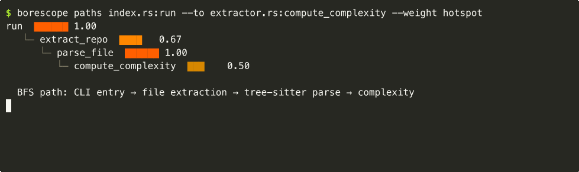
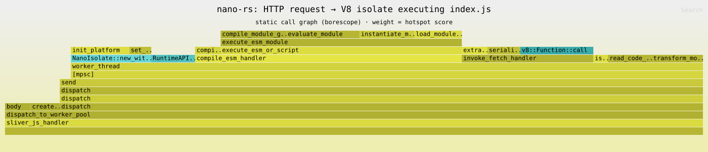

# Borescope Recipes

Cookbook of common workflows — human and agent.

## Quick reference

```bash
# Two-phase cold start (D8)
borescope index --no-git    # Phase 1: fast; paths/callers/map/explain work immediately
borescope index --git &     # Phase 2: background; needed for hotspots/smells/age/coupled

borescope map --weight hotspot -o tui        # interactive explorer
borescope smells                             # grouped antipattern + semantic report
borescope explain <symbol>                   # plain-English profile
borescope explain-pr <branch>                # PR impact analysis
```

---

## 1. Explore an unfamiliar codebase

```bash
cd some-repo
borescope index --git
borescope hotspots --top 15              # what production files change constantly and recently?
borescope smells                         # where are the structural + semantic problems?
borescope map --weight hotspot -o tui    # navigate the whole tree interactively
borescope explain <top-hotspot-fn>       # understand the riskiest symbol
```

`hotspots` output (test files hidden by default — `--include-tests` to show them):

```
hotspot = churn × recency  (1.0 = changed constantly and just recently; 0.0 = never touched)

hotspot  churn  age      heat            file
------------------------------------------------------------------------
0.857    22     3 days   🔥 very hot     src/http/router.rs
0.714    18     1 wks    🔥 hot          src/auth/token.rs
0.412    11     6 wks    warm            src/db/pool.rs
0.089    4      8 mo     cool            src/config.rs
```

Read the table as: "router.rs changed 22 times, last touched 3 days ago — if something's broken,
start here." The recency decay means a file touched 8 months ago ranks lower even if it has high
raw churn — it's not the active fire today.

**What you get**: within 30 seconds you know which production files are the active fire risk,
which have structural antipatterns, and a plain-English profile of the worst offender.

---

## 2. PR review — understand impact before merging

```bash
# Narrative PR impact report
borescope explain-pr feature/my-branch
borescope explain-pr feature/my-branch --base develop   # explicit base

# Call-tree diff view
borescope diff main HEAD --weight hotspot
borescope branch feature/my-branch -o tui               # interactive branch diff
```

`explain-pr` reports:
- Changed files (capped at 20)
- High-risk symbols (hot + complex, or dangerous patterns)
- Co-change warnings: files that usually move with these but aren't in the PR
- Semantic patterns in touched code (lock, await, spawn…)
- Bottom-line risk verdict

`-o json` gives the full list for tooling:
```bash
borescope explain-pr feature/my-branch -o json | jq '.high_risk[] | .qualified'
```

---

## 3. Blast radius before touching a function

```bash
borescope callers src/worker/pool.rs:dispatch --depth 4 -o tui
borescope callers src/worker/pool.rs:dispatch -o json   # for agents
```

Shows everything that calls your target, recursively. Low-confidence edges (┄) are cross-file guesses — treat them as leads.

---

## 4. Plain-English symbol profile

```bash
borescope explain dispatch_to_worker_pool
borescope explain src/http/router.rs:handle
borescope explain src/http/router.rs:42      # by line number
```

Output:
- File, kind, LOC, complexity
- Hotspot rating with narrative (cold / lukewarm / warm / 🔥 very hot)
- Fanin/fanout with blast-radius interpretation
- Semantic pattern warnings (⚠ lock+await, ⚠ block_on)
- Co-change partners with coupling strength
- Risk verdict (LOW / MEDIUM / HIGH RISK)

---

## 5. Forward exploration from an entry point

```bash
borescope paths src/http/router.rs:dispatch_to_worker_pool --depth 5 -o tui
borescope paths src/http/router.rs:dispatch_to_worker_pool --weight churn

# BFS path to a specific target
borescope paths src/http/router.rs:handle --to storage.go:Save

# LLM-legible signal array (for agents)
borescope paths src/http/router.rs:handle --analyze
```

The TUI detail panel (cyan bar) shows the weight description and selected node's score + file. The confidence tag `┄0.3` means the linker guessed the edge — not a guaranteed call. `(ext)` means unresolvable callee (stdlib, OS, unindexed dep).

---

## 6. Predict production behavior under load

You have an HTTP handler and want to know how a downstream function will behave when traffic spikes. The `--to` flag traces the exact call path; `--weight hotspot` scores each frame by churn × recency; `--analyze` emits a machine-readable signal array for the function itself.

```bash
# Step 1: find the shortest path from entry point to the function in question
borescope paths api/handler.go:HandleCheckout --to store/db.go:InsertOrder --weight hotspot
```



```
HandleCheckout                           ██████ 0.82  ← high churn entry
├─ OrderService.submit()                 █████  0.71  ← also hot — co-changes often
│  └─ db.InsertOrder()                   ███    0.47  ← moderate — stable but central
```

Each frame's hotspot score = churn × recency. High score means "changes often and recently" — the blast radius if this frame breaks under load is proportional to how many callers arrive through it.

```bash
# Step 2: structured signal array on the target
borescope paths store/db.go:InsertOrder --analyze
```

```json
[
  { "kind": "fanin",      "severity": "high",     "detail": "called by 14 symbols — all load goes here" },
  { "kind": "alloc",      "severity": "medium",   "detail": "3 allocation sites — GC pressure under volume" },
  { "kind": "complexity", "severity": "medium",   "detail": "complexity=11, threshold=10" }
]
```

`fanin` is the load multiplier: every caller funnels through this one function. High `alloc` inside a high-fanin function = GC pauses that appear only at scale.

```bash
# Step 3: plain-English profile — concurrency patterns + co-change partners
borescope explain store/db.go:InsertOrder
```

Look for:
- `⚠ lock_across_await` — mutex held across an async yield = deadlock when concurrency > 1
- `⚠ sync_in_async` — blocking call inside async fn = executor thread starvation under load
- co-change partners (especially `connection_pool.go`, `retry.go`) — if they move together, a load-related fix usually touches all of them

```bash
# Step 4 (optional): see every entry point that funnels into this function
borescope callers store/db.go:InsertOrder --depth 3 --weight hotspot -o tui
```

The TUI detail panel shows each caller's hotspot score — the ones coloured red are the traffic sources most likely to spike first.

**Reading the result**: a function with fanin > 10, any `alloc` pattern, and a hotspot score above 0.5 on the path to it is a load-amplification point. It will not show up in a unit test. It shows up when traffic multiplies the allocation rate by `fanin`.

---

## 7. Find what always changes together

```bash
borescope coupled src/worker/pool.rs
borescope coupled src/runtime/apis.rs --min 0.5   # only strong pairs
```

Co-change strength ≥ 0.8 both ways = tangled pair. Candidate for interface refactor or merge. Invisible in the call graph, visible immediately in git history.

---

## 8. Semantic antipattern audit

```bash
borescope smells
borescope smells --recommend    # adds cargo audit / semgrep suggestions
```

Findings are grouped by kind with a description and top 3 examples:

```
[lock_across_await] — mutex held across .await — deadlock risk (148 symbols)
  • src/worker/pool.rs:dispatch_to_worker_pool
  • src/runtime/handler.rs:handle_request
  … and 146 more
```

`--recommend` checks co-change partners for security-sensitive filenames (auth, crypto, token, secret…) and suggests `cargo audit` or `semgrep --config=p/security-audit`.

---

## 9. Identify technical debt before a sprint

```bash
borescope smells
borescope hotspots --top 20
borescope age
```

`smells` reports:
- **shotgun-surgery**: one file with ≥4 strong co-change partners → changes ripple everywhere
- **god-file**: high LOC + high complexity + high fanin
- **stale-core**: rarely touched but many callers depend on it
- **tangled-pair**: two files that always change together → missing abstraction
- **Semantic**: lock_across_await, sync_in_async, alloc_in_hotspot, high_complexity_bottleneck, spawn_in_tight_loop, unbalanced_fanout

---

## 10. Agent context preparation (skill workflow)

Before reading source files, ask borescope for the relevant slice:

```bash
# Agent receives: "refactor PaymentService.charge"
borescope index --no-git                                    # Phase 1: fast
borescope index --git &                                     # Phase 2: background
borescope explain src/payment.py:charge                     # understand the symbol first
borescope paths src/payment.py:charge --analyze             # signal array for LLM
borescope callers src/payment.py:charge -o json --depth 3
# → agent reads JSON, identifies caller files, opens only those
borescope explain-pr feature/refactor -o json               # verify PR impact before merge
```

Measured: cuts source bytes read by ~31% vs grep-and-read-all-files on the `testdata/eval-fixture` rename task (17 KB vs 26 KB; 5 files vs 9; recall 100%).
See `docs/eval.md` for methodology and `harness/` for reproducible measurement.

---

## 11. Post-security-patch impact check

```bash
borescope diff <before-sha> <after-sha> --weight hotspot
borescope coupled src/runtime/fetch.rs
borescope smells --recommend
```

`coupled` reveals which other files are historically co-changed with the patched file. `smells --recommend` checks if co-change partners have security-sensitive names and suggests external scanners.

---

## 12. JSON output for scripting

All commands support `-o json`. Schema 1 is stable (additive only):

```bash
# hotspots: flat array of {path, churn, age_days, hotspot, lang, loc, …}
borescope hotspots --top 5 -o json | jq '.[] | {path, hotspot, churn}'

# callers: {root: {name, file, children: […]}}
borescope callers src/auth.rs:verify -o json | jq '.root.children | length'

# smells: {shotgun_surgery, god_file, tangled_pair, semantic: [{kind, symbol, file, detail}], …}
borescope smells -o json | jq '.semantic | group_by(.kind) | map({kind: .[0].kind, count: length})'

# explain: {symbol, file, kind, span, loc, complexity, churn, hotspot, fanin, fanout, patterns, cochange_partners}
borescope explain dispatch_to_worker_pool -o json | jq '{hotspot, complexity, fanin, patterns}'

# explain-pr: {branch, base, changed_files, high_risk: […], missed_cochange: […], …}
borescope explain-pr feature/branch -o json | jq '.missed_cochange'
```

---

## 13. Generate a flamegraph from the call tree

```bash
cargo install inferno   # one-time

borescope paths src/http/router.rs:dispatch_to_worker_pool \
  --weight hotspot \
  -o folded \
  | inferno-flamegraph \
      --title "HTTP request → V8 isolate" \
      --colors rust \
      --width 1400 \
  > flame.svg
open flame.svg
```

Folded output is Brendan Gregg collapsed format. Each leaf in the call tree becomes a stack frame;
width is proportional to the `--weight` score (uniform if no weight is chosen).

**Real example — HTTP request to V8 isolate** (from [nano-rs](https://github.com/gleicon/nano-rs)):



The graph traces the full static path from the HTTP ingress through the worker pool
MPSC channel (`[mpsc]`) to the V8 isolate compiling and evaluating `index.js`. The three
V8 module lifecycle phases (`compile_module_graph`, `instantiate_module`, `evaluate_module`)
are visible as distinct sub-frames inside `execute_esm_module`, making the compilation
cost breakdown immediately readable — without ever running the server.

---

## 14. Diagram output — share call graphs in PRs and docs

`-o mermaid` emits a fenced Mermaid block that renders in GitHub, Claude Code, Cursor, VS Code,
and any Markdown-aware surface. `-o dot` emits Graphviz DOT for large graphs or PNG export.

```bash
# Paste a sequence diagram into a PR comment
borescope paths api/handler.go:HandleCheckout --to db.go:InsertOrder -o mermaid

# Show co-change coupling as a dependency graph in a doc
borescope coupled src/auth.rs -o mermaid

# Antipattern overview for a code review comment
borescope smells -o mermaid

# Full call tree as flowchart
borescope callers src/worker/pool.rs:dispatch -o mermaid
```

For large graphs, use DOT + Graphviz (install: `brew install graphviz`):

```bash
borescope map --weight hotspot -o dot --no-fence | dot -Tpng -o hotspot-map.png
borescope paths src/auth.rs:verify  -o dot --no-fence | dot -Tsvg -o auth-paths.svg
```

`--no-fence` strips the code fence for piping. Without it, the Mermaid/DOT block renders as-is.

---

## 15. Install the skill on your AI coding platform

The `skill` command prints the embedded skill file — redirect it to wherever your platform expects it:

```bash
# Claude Code (global, loads in every repo)
borescope skill > ~/.claude/skills/borescope.md

# Cursor (repo-local rule, always applied)
mkdir -p .cursor/rules
borescope skill > .cursor/rules/borescope.md

# OpenHands / any agent with a system-prompt-file flag
borescope skill > /tmp/borescope-skill.md
```

Or use the installer script:
```bash
./skill/ensure-borescope.sh --skill    # installs binary + Claude Code skill
./skill/ensure-borescope.sh --cursor   # installs binary + Cursor rule
```

---

## TUI keybindings

| Key | Action |
|---|---|
| `j` / `↓` | move down |
| `k` / `↑` | move up |
| `Enter` / `Space` | expand / collapse node |
| `g` | jump to top |
| `G` | jump to bottom |
| `/` | enter filter mode (by name or file) |
| `Esc` | exit filter mode / quit |
| `q` | quit |

The cyan detail panel above the help line shows the weight description for the current view and the selected node's exact score + file path.
