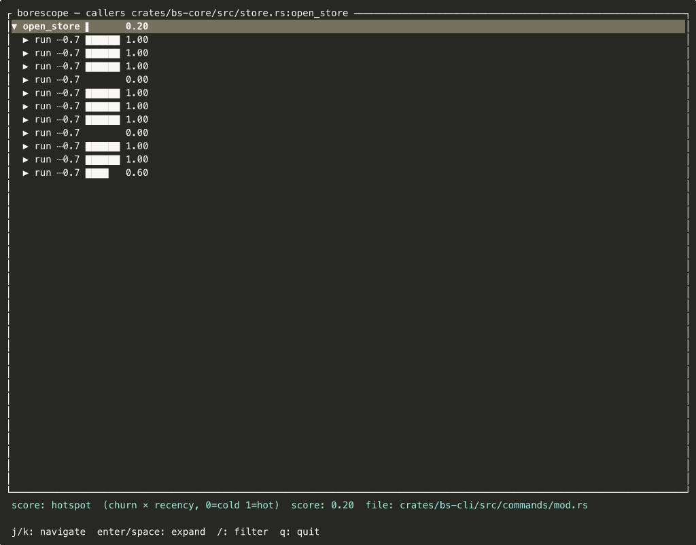

# Borescope — Commands Reference

## Index

```bash
borescope index [--no-git] [--git] [--full] [--grammar-path <dir>]
```

| Flag | Default | Description |
|---|---|---|
| `--no-git` | — | Skip git history mining. Fast Phase 1: paths/callers/map/explain work immediately |
| `--git` | on | Mine git history (churn, age, hotspot, co-change). Required for hotspots/smells/age |
| `--full` | — | Force full reindex; ignore incremental fingerprints |
| `--grammar-path <dir>` | — | Load `.so` + `.scm` grammar packs from this directory |

**Two-phase cold start:**
```bash
borescope index --no-git    # Phase 1: seconds — structural queries ready
borescope index --git &     # Phase 2: background — git signals ready when done
```

---

## Queries

### paths — forward slice

```bash
borescope paths <target> [--to <target>] [--analyze]
```

Everything statically reachable from `target`. With `--to`, returns the shortest BFS path between two symbols. With `--analyze`, emits a structured signal array suitable for LLM consumption.

### callers — reverse slice

```bash
borescope callers <target>
```

All symbols that call `target`, recursively to `--depth`.



### diff — call-tree diff

```bash
borescope diff [rev1 [rev2]]
```

Marks each frame `+` added, `-` removed, `~` modified relative to the revision pair. Defaults to `HEAD~1 HEAD`. Pairs with `--weight diff` to score by change size.

### branch — branch impact

```bash
borescope branch <name> [--base <rev>]
```

Like `diff`, but compares `<name>` against its merge-base with `<base>` (default `main`).

### map — repo overview

```bash
borescope map [--zoom pkg|mod|fn] [--top N]
```

Containment tree of the entire repository. `--zoom fn` (default) shows individual symbols; `--zoom pkg` aggregates by directory.

### explain — symbol profile

```bash
borescope explain <target>
```

Plain-English narrative: heat rating, complexity, fanin/fanout, concurrency patterns, co-change partners, risk verdict (LOW / MEDIUM / HIGH RISK).

### explain-pr — PR impact

```bash
borescope explain-pr <branch> [--base <rev>]
```

Changed files, high-risk symbols, co-change warnings (missing files), semantic patterns in touched code, bottom-line verdict.

### hotspots

```bash
borescope hotspots [--top N]
```

Churn × complexity ranking. Requires git phase.

### coupled

```bash
borescope coupled <file> [--min <strength>]
```

Co-change partners of a file: files that historically change together. Strength 0..1; default minimum 0.3.

### age

```bash
borescope age [--zoom pkg|mod|fn]
```

Code-age view: last-modified date per symbol, coloured by staleness.

### smells

```bash
borescope smells [--recommend]
```

Antipattern + semantic pattern report. `--recommend` adds `cargo audit` / `semgrep` suggestions for security-sensitive co-change pairs.

---

## Global flags

```
--repo <path>         Repository root (default: walk up from cwd until .git found)
--depth N             Max tree depth (default: 3)
--zoom pkg|mod|fn     Aggregation level (default: fn)
--weight none|loc|fanin|churn|hotspot|diff
-o tree|folded|json|html|tui
--min-confidence F    Hide edges below this confidence (default: 0.0)
--no-color            Plain ASCII — no ANSI colour
-q / --quiet          Suppress progress output
-v / --verbose        Extra detail (e.g., linker resolution stats)
```

---

## Target syntax

```
path/to/file.go:FuncName    file + symbol name
path/to/file.go:42          file + line number (resolves to enclosing symbol)
FuncName                    global name search
```

Global name search exits with code **3** and lists candidates on stderr as a JSON array when the name is ambiguous. Pick the fully-qualified form and retry.

---

## Exit codes

```
0   success
1   runtime error
2   usage error (bad flags, incompatible options)
3   ambiguous target — candidates on stderr as JSON array of qualified names
4   index missing or corrupt — run `borescope index`
5   grammar unavailable for the requested file extension
```

---

## Configuration

Place config files in `.borescope/` at the repo root.

### `.borescope/thresholds.toml` — risk thresholds

```toml
[default]
hotspot_high    = 0.7   # alloc_in_hotspot and complexity_bottleneck upper threshold
hotspot_medium  = 0.5   # complexity_bottleneck lower threshold
complexity_high = 10    # cyclomatic complexity ceiling
fanin_high      = 8     # fanin ceiling for bottleneck detection
```

### `.borescope/smells.toml` — custom smell rules

```toml
[[rules]]
name        = "dangerous_combo"
description = "holds lock while spawning inside a loop"
patterns    = ["lock", "spawn", "loop"]
severity    = "critical"
```

A rule fires when **all** listed patterns appear on the same symbol.

### `.borescope/queries/<lang>.scm` — query overrides

Drop a `<lang>.scm` file here to override the built-in tree-sitter query pack for that language. Useful for project-specific pattern captures.
