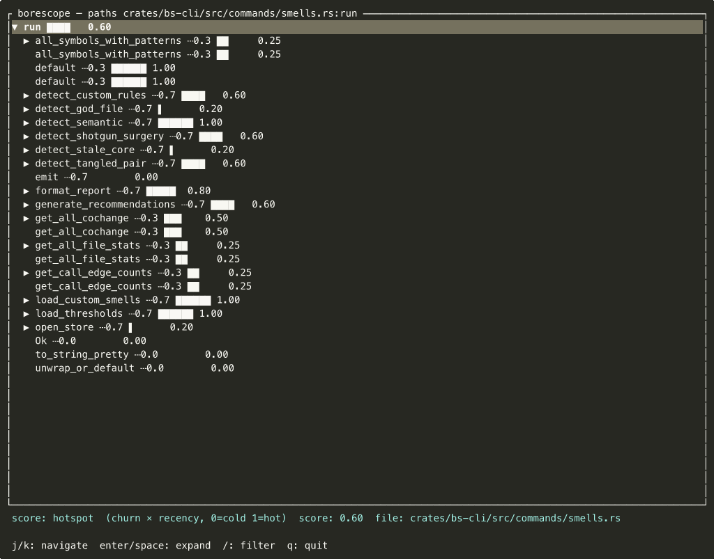

# Borescope — Output Formats

Select with `-o <format>` (global flag, works on all query commands).

---

## tree (default)

ANSI call tree with weight bars and confidence annotations.

```
HandleCheckout                           ██████ 0.82
├─ validateCart()                        ████   0.61
│  ├─ PriceService.quote()               ▌      0.07
│  └─ Inventory.check()                  █      0.12
├─ services.boot()                       ▌      0.05
└─ SessionManager.open()   ┄┄ 0.5        █      0.15
```

- `██████ 0.82` — weight bar (normalized 0..1 in this response) + score
- `┄┄ 0.5` — confidence annotation; edge is a linker guess, not certain
- `(ext)` — unresolvable callee (stdlib, OS, unindexed dependency)
- `+` / `-` / `~` prefix — diff/branch frame classification

Add `--no-color` for plain ASCII output (CI, log files).

---

## tui

Interactive terminal UI. Best for exploration.

```bash
borescope map --weight hotspot -o tui
borescope paths src/http/router.rs:handle --depth 5 -o tui
```



**Detail panel** (cyan bar, always visible): shows what the current weight mode means and the selected node's exact score + file path.

### Keybindings

| Key | Action |
|---|---|
| `j` / `↓` | Move down |
| `k` / `↑` | Move up |
| `Enter` / `Space` | Expand / collapse node |
| `g` | Jump to top |
| `G` | Jump to bottom |
| `/` | Enter filter mode (by name or file substring) |
| `Esc` | Exit filter / clear |
| `q` | Quit |

---

## json

Stable schema 1 contract — designed for agent and tool consumption.

```bash
borescope paths src/auth.rs:verify -o json
borescope callers src/auth.rs:verify -o json | jq '.root.children | length'
borescope smells -o json | jq '.semantic | group_by(.kind)'
```

**Stability guarantee**: additive changes only under `"schema": 1`. New fields may appear; existing fields are never removed or renamed. Breaking changes bump the schema number.

Full schema documentation: [`docs/agent-contract.md`](agent-contract.md).

---

## folded

Brendan Gregg collapsed format — pipe to `inferno-flamegraph` to produce SVG.

```bash
borescope paths src/http/router.rs:dispatch -o folded \
  | inferno-flamegraph > flame.svg
open flame.svg
```

Install inferno: `cargo install inferno`.

---

## html

Self-contained collapsible call tree. No network requests; single file you can open or attach to a PR.

```bash
borescope paths src/auth.rs:verify -o html > auth_verify.html
open auth_verify.html
```

---

## mermaid

Mermaid diagram — wrapped in a fenced ` ```mermaid ``` ` block by default so it renders immediately
in GitHub PRs, Claude Code, Cursor, VS Code Preview, and any Markdown-aware surface.

Each command emits the diagram type natural to its data:

| Command | Diagram type |
|---|---|
| `paths --to` | `sequenceDiagram` — call chain A → B → C |
| `paths` (full slice) | `flowchart TD` — full call tree, top-down |
| `callers` | `flowchart BT` — who calls X, bottom-to-top |
| `map` | `flowchart TD` — file × symbol heatmap |
| `coupled` | `flowchart LR` — undirected co-change dependency graph |
| `smells` | `classDiagram` — files as classes, smell kinds as members |
| `diff` / `branch` | `flowchart TD` — diff call tree |

```bash
# Sequence diagram: trace call chain from entry to DB layer
borescope paths api/handler.go:HandleCheckout --to db.go:InsertOrder -o mermaid

# Co-change dependency graph — paste into a PR to show coupling
borescope coupled src/auth.rs -o mermaid

# Antipattern class diagram — files with smell findings as members
borescope smells -o mermaid

# Raw Mermaid syntax without code fence (for piping or agent injection)
borescope map --weight hotspot -o mermaid --no-fence
```

`--no-fence` suppresses the ` ```mermaid ``` ` wrapper. Use it when piping into a script that wraps
the block itself, or when passing to an agent that will re-emit the content in its own format.

---

## dot

Graphviz DOT diagram — wrapped in a fenced ` ```dot ``` ` block by default. Prefer `-o dot` over
`-o mermaid` for large graphs where layout quality matters — Graphviz's layout engine handles dense
call graphs significantly better than Mermaid's.

```bash
# Render to PNG (requires graphviz installed: brew install graphviz)
borescope map -o dot --no-fence | dot -Tpng -o call-map.png
open call-map.png

# SVG for embedding in docs
borescope paths src/auth.rs:verify -o dot --no-fence | dot -Tsvg -o auth-paths.svg

# Raw DOT in a fenced block (renders in any dot-aware surface)
borescope callers src/db.rs:Query -o dot
```

Neither `mermaid` nor `dot` requires a runtime dependency — both are pure text output.

---

## Weight modes (`--weight`)

Affects the bar chart score on every frame. All weights are normalized 0..1 within a single response.

| Weight | Score |
|---|---|
| `none` (default) | 0.0 — bars disabled |
| `loc` | Lines of code (raw size) |
| `fanin` | Number of callers (how central) |
| `churn` | Commit frequency (how often it changes) |
| `hotspot` | Churn × recency decay (active fire risk) |
| `diff` | Change size in current diff (only with `diff`/`branch`) |

`--weight diff` is only valid with the `diff` or `branch` command; all others exit 2 with a clear error.
